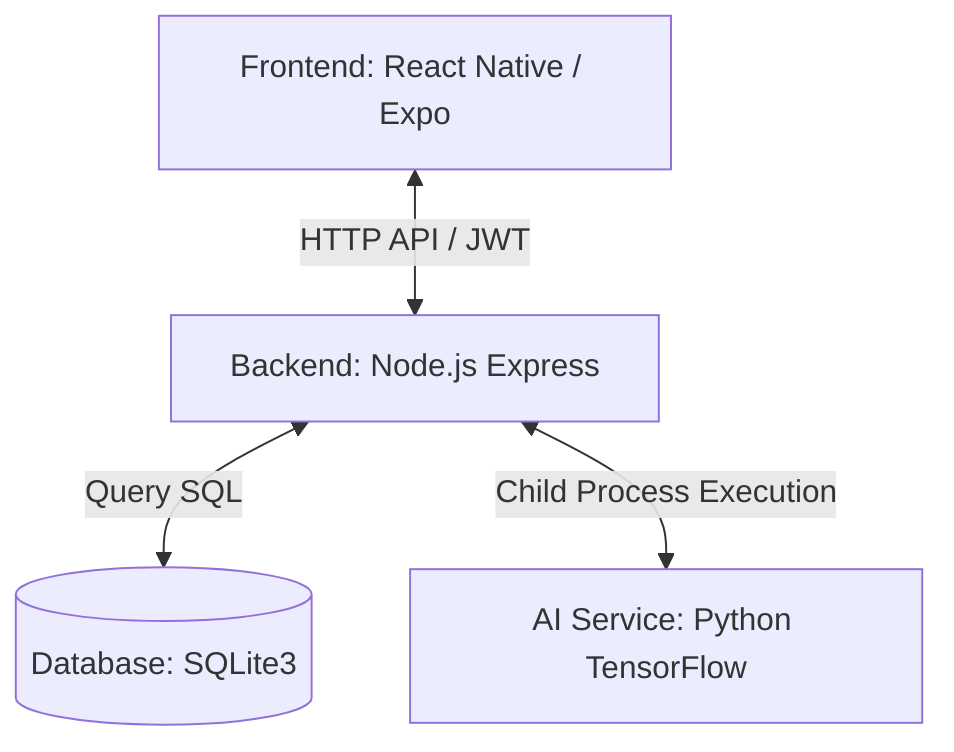
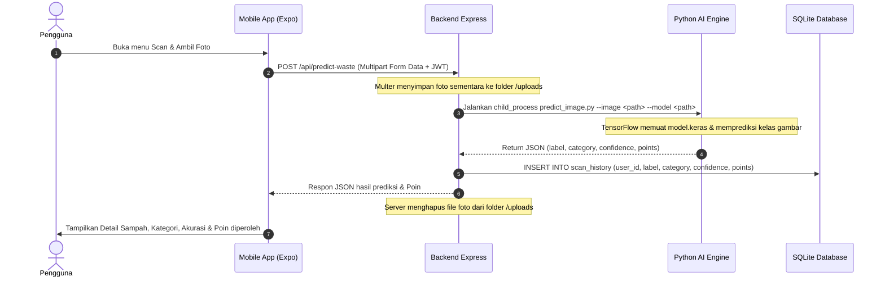

# Product Requirement Document (PRD) - EcoClassify

## 1. Informasi Dokumen
*   **Nama Produk:** EcoClassify (CyberWasteApp)
*   **Versi Dokumen:** v1.0.0
*   **Tanggal:** 10 Juni 2026
*   **Status:** Draft / Proposed
*   **Target Pengguna:** Masyarakat umum, pelajar, aktivis lingkungan, dan pengelola bank sampah.

---

## 2. Ringkasan Eksekutif (Executive Summary)
EcoClassify adalah aplikasi mobile berbasis React Native (Expo) yang dirancang untuk meningkatkan kesadaran lingkungan dan memfasilitasi pemilahan sampah secara cerdas. Menggunakan teknologi *Deep Learning* (Convolutional Neural Network) yang dijalankan melalui pipeline Python TensorFlow di backend, aplikasi ini mendeteksi jenis sampah dari kamera *smartphone* secara *real-time*, mengategorikannya sebagai sampah Organik atau Anorganik, dan memberikan insentif berupa **Eco Poin** yang dapat ditukarkan dengan berbagai hadiah fisik atau digital.

### Masalah:
1.  **Kurangnya Edukasi:** Masyarakat sering kali kesulitan membedakan kategori sampah secara spesifik.
2.  **Kurangnya Motivasi:** Tidak ada insentif langsung bagi individu yang melakukan pemilahan sampah secara mandiri.
3.  **Proses Pemilahan Manual yang Lambat:** Memerlukan waktu untuk mengidentifikasi jenis sampah satu per satu secara manual.

### Solusi:
Aplikasi mobile dengan fitur pemindaian AI instan yang terintegrasi dengan sistem poin gamifikasi (*leveling*) dan katalog penukaran hadiah guna meningkatkan partisipasi daur ulang.

---

## 3. Arsitektur Sistem & Spesifikasi Teknologi

Aplikasi ini menggunakan arsitektur tiga lapis (*Three-Tier Architecture*):



### Tech Stack:
*   **Frontend Mobile:** React Native (Expo SDK v55), TypeScript, Redux Toolkit (State Management), React Navigation (Tabs, Stack).
*   **Backend Server:** Node.js, Express, SQLite3 (Database relasional ringan), Multer (Penanganan upload file gambar).
*   **Machine Learning Pipeline:** Python 3, TensorFlow/Keras (CNN Model `best_model.keras`), NumPy.

---

## 4. Alur Kerja Pemindaian AI (AI Scan Flow)

Ketika pengguna mengambil foto sampah melalui kamera aplikasi:



---

## 5. Kebutuhan Fungsional (Functional Requirements)

### 5.1 Autentikasi Pengguna & Sesi (Authentication)
*   **Pendaftaran (Register):**
    *   Pengguna mendaftar menggunakan *username*, *email*, dan *password* (min. 6 karakter).
    *   *Password* dienkripsi di backend menggunakan `bcryptjs` (salt rounds: 10).
*   **Masuk (Login):**
    *   Pengguna dapat masuk menggunakan *email* atau *username*.
    *   Autentikasi menggunakan JSON Web Token (JWT) yang berlaku selama 7 hari (`expiresIn: '7d'`).
*   **Sesi (Session):**
    *   Mengamankan rute-rute API penting dengan middleware `authenticateToken`.

### 5.2 Dashboard Screen
*   **Status Model AI:** Menampilkan status kesiapan model secara *real-time* ("Model siap!").
*   **Navigasi Cepat:** Tombol jalan pintas untuk melakukan klasifikasi sampah ("Klasifikasi Sekarang").
*   **Ringkasan Sampah yang Didukung:**
    *   **Organik (6 Jenis):** Buah, Bunga, Campuran, Daging, Daun, Makanan.
    *   **Anorganik (5 Jenis):** Kardus, Kertas, Plastik, Kaca, Logam.
*   **Grid Kategori:** Tampilan visual jumlah jenis sampah per kategori utama.

### 5.3 Modul Pemindaian AI (AI Scanner)
*   Menggunakan library `expo-camera` untuk akses kamera *smartphone*.
*   Menangkap gambar berkualitas tinggi dan mengirimkannya via API dalam format *multipart form data*.
*   Mendapatkan hasil klasifikasi yang terdiri dari:
    *   **Label Sampah:** Jenis spesifik (misal: "botol plastik").
    *   **Kategori:** Organik / Anorganik / B3 (Bahan Berbahaya & Beracun).
    *   **Tingkat Akurasi (Confidence Score):** Persentase kepastian model AI.
    *   **Eco Poin:** Jumlah poin yang didapat dari scan tersebut.

### 5.4 Gamifikasi & Eco Poin (Eco Point & Rewards)
*   **Perhitungan Poin (Points System):**
    *   Sampah Organik = **5 Poin**
    *   Sampah Anorganik = **10 Poin**
    *   Sampah B3 = **25 Poin**
*   **Sistem Leveling (User Levels):**
    *   `Bronze`: 0 - 99 Poin.
    *   `Silver`: 100 - 299 Poin.
    *   `Gold`: 300 - 699 Poin.
    *   `Platinum`: >= 700 Poin (Maksimum Level).
*   **Kalkulator Dampak Lingkungan:** Estimasi jumlah CO2 yang berhasil dikurangi pengguna (dihitung sebagai: `jumlah sampah didaur ulang * 0.68 kg CO2`).
*   **Penukaran Hadiah (Rewards Redemption):**
    Pengguna dapat melihat daftar hadiah yang tersedia untuk ditukarkan dengan poin:

| ID Hadiah | Nama Hadiah | Deskripsi | Poin Dibutuhkan | Status Ketersediaan |
| :--- | :--- | :--- | :--- | :--- |
| 1 | Voucher Belanja | Voucher senilai Rp10.000 | 50 Poin | Tersedia |
| 2 | Pulsa Listrik | Pulsa senilai Rp20.000 | 100 Poin | Tersedia |
| 3 | Bibit Tanaman | Paket 3 bibit pohon penghijauan | 150 Poin | Tersedia |
| 4 | E-Tumbler | Tumbler ramah lingkungan (Stainless) | 300 Poin | Segera Hadir / Habis |
| 5 | Voucher Makanan | Voucher makanan senilai Rp50.000 | 500 Poin | Segera Hadir / Habis |

### 5.5 Riwayat Pemindaian (Scan History)
*   Menampilkan daftar seluruh pemindaian yang pernah dilakukan oleh pengguna.
*   Diurutkan berdasarkan tanggal terbaru (*descending chronological order*).
*   Menampilkan detail berupa: jenis sampah, kategori, tingkat akurasi (dalam %), jumlah poin yang didapat, dan waktu pemindaian.

### 5.6 Profil & Pengaturan (Profile Settings)
*   **Edit Profil:** Memperbarui *username* dan *email* pengguna.
*   **Ubah Password:** Fitur mengganti *password* akun dengan memverifikasi *password* lama terlebih dahulu.
*   **Pengaturan Notifikasi (Toggles):**
    *   Pengingat Scan (Scan Reminders)
    *   Pembaruan Hadiah (Reward Updates)
    *   Tips Lingkungan (Eco Tips)
    *   Pembaruan Aplikasi (App Updates)
*   **Pengaturan Bahasa (Multilingual Support):**
    *   Bahasa Indonesia (`id`) - Default
    *   English (`en`)
    *   Basa Jawa (`jv`)
    *   Basa Sunda (`su`)
*   **Menu Bantuan & Tentang Aplikasi (Help & About):** Menyediakan dokumentasi penggunaan aplikasi.

---

## 6. Model Data & Skema Database SQLite

Database disimpan secara lokal pada file `backend/database.sqlite` dengan tabel-tabel berikut:

### 6.1 Tabel `users`
Menyimpan informasi dasar akun pengguna.

```sql
CREATE TABLE IF NOT EXISTS users (
  id INTEGER PRIMARY KEY AUTOINCREMENT,
  username TEXT NOT NULL UNIQUE,
  email TEXT NOT NULL UNIQUE,
  password TEXT NOT NULL,
  created_at DATETIME DEFAULT CURRENT_TIMESTAMP
);
```

### 6.2 Tabel `notification_settings`
Menyimpan konfigurasi notifikasi personal pengguna.

```sql
CREATE TABLE IF NOT EXISTS notification_settings (
  user_id INTEGER PRIMARY KEY,
  scan_reminders INTEGER DEFAULT 1,
  reward_updates INTEGER DEFAULT 1,
  eco_tips INTEGER DEFAULT 1,
  app_updates INTEGER DEFAULT 1,
  FOREIGN KEY (user_id) REFERENCES users(id)
);
```

### 6.3 Tabel `user_preferences`
Menyimpan konfigurasi preferensi bahasa aplikasi.

```sql
CREATE TABLE IF NOT EXISTS user_preferences (
  user_id INTEGER PRIMARY KEY,
  language_code TEXT DEFAULT 'id',
  FOREIGN KEY (user_id) REFERENCES users(id)
);
```

### 6.4 Tabel `scan_history`
Menyimpan seluruh catatan transaksi pemindaian dan perolehan poin pengguna.

```sql
CREATE TABLE IF NOT EXISTS scan_history (
  id INTEGER PRIMARY KEY AUTOINCREMENT,
  user_id INTEGER NOT NULL,
  label TEXT NOT NULL,
  category TEXT NOT NULL,
  confidence REAL NOT NULL,
  points INTEGER NOT NULL,
  created_at DATETIME DEFAULT CURRENT_TIMESTAMP,
  FOREIGN KEY (user_id) REFERENCES users(id)
);
```

---

## 7. Kebutuhan Non-Fungsional (Non-Functional Requirements)

### 7.1 Kinerja (Performance)
*   **Waktu Respon Prediksi:** Proses inferensi gambar oleh model TensorFlow melalui child process Python harus selesai dalam waktu kurang dari 5 detik pada spesifikasi server standar.
*   **Efisiensi Penyimpanan:** File gambar sampah yang diunggah harus dihapus segera setelah prediksi selesai dijalankan untuk menghemat ruang disk server (`fs.unlink`).

### 7.2 Keamanan (Security)
*   Setiap request API ke endpoint privat wajib menyertakan token JWT pada Authorization header (`Bearer <token>`).
*   Penyimpanan password wajib di-hash menggunakan algoritma blowfish-based bcryptjs.
*   Pencegahan SQL Injection diakomodasi dengan parameter bindings (`?`) pada setiap query sqlite3.

### 7.3 Kompatibilitas (Compatibility)
*   **Aplikasi Mobile:** Berjalan optimal pada sistem operasi Android (versi 9 ke atas) dan iOS (versi 13 ke atas) melalui kompilasi Expo.
*   **API URL Setup:** Konfigurasi dynamic endpoint menggunakan IP localhost `10.0.2.2:5000` untuk Android Emulator, dan dynamic IP config jika dijalankan langsung pada HP fisik.

---

## 8. Roadmap & Pengembangan Selanjutnya (Future Enhancements)
1.  **Inferensi On-Device (TFLite):** Memindahkan proses klasifikasi sampah secara langsung ke dalam aplikasi mobile menggunakan TensorFlow Lite (`.tflite` model yang sudah disiapkan) untuk memungkinkan pemindaian offline tanpa koneksi internet.
2.  **Integrasi Google Maps API:** Menambahkan peta lokasi Bank Sampah terdekat agar pengguna dapat langsung menyalurkan sampah daur ulangnya secara fisik.
3.  **Fitur Papan Peringkat (Leaderboard):** Menampilkan ranking perolehan Eco Poin pengguna secara global guna memupuk persaingan sehat dan meningkatkan interaksi sosial (*gamification*).
4.  **Dukungan Sampah B3:** Melatih ulang model untuk mengklasifikasi kategori sampah Bahan Berbahaya & Beracun (seperti baterai, lampu bekas, limbah elektronik) dengan reward poin yang lebih tinggi (25 Poin).
