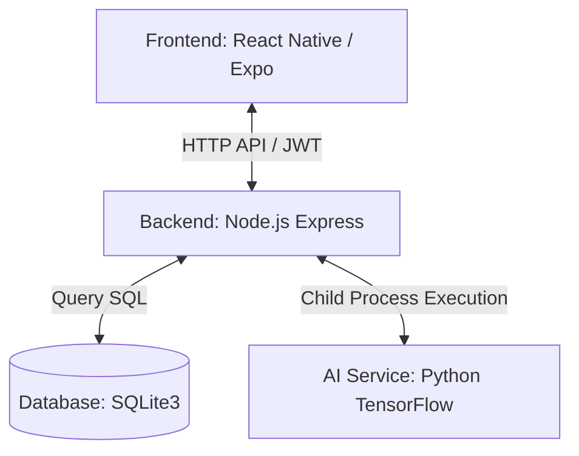

# ♻️ EcoClassify (CyberWasteApp)
Aplikasi Mobile Pemilah Sampah Cerdas Berbasis Deep Learning (Convolutional Neural Network) & Gamifikasi Eco Poin.

---

## 📌 Deskripsi Proyek
**EcoClassify** adalah solusi teknologi ramah lingkungan yang mengintegrasikan aplikasi mobile berbasis **React Native (Expo)**, backend server **Node.js Express**, dan pipeline kecerdasan buatan (**TensorFlow/Keras**) berbasis Python. Aplikasi ini membantu pengguna mengklasifikasikan jenis sampah secara *real-time* dari kamera *smartphone*, mengidentifikasi apakah sampah tersebut termasuk kategori Organik atau Anorganik, dan memberikan apresiasi berupa **Eco Poin** yang dapat ditukarkan dengan berbagai hadiah fisik maupun digital untuk mendorong budaya daur ulang di masyarakat.

---

## Arsitektur Sistem
Sistem ini menggunakan arsitektur tiga lapis (*Three-Tier Architecture*):



1. **Frontend**: Antarmuka pengguna mobile untuk memindai sampah, melihat riwayat scan, melacak Eco Poin, dan menukar hadiah.
2. **Backend**: Server API yang menangani autentikasi pengguna, penyimpanan riwayat pemindaian, manajemen profil, dan eksekusi model AI.
3. **AI Service**: Mesin inferensi Python yang memuat model neural network (`.keras`) untuk memproses citra sampah dan memprediksi kelasnya.

---

## 🛠️ Spesifikasi Teknologi (Tech Stack)
*   **Frontend Mobile:** React Native (Expo SDK v55), TypeScript, Redux Toolkit, React Navigation (Drawer & Bottom Tabs), Expo Camera.
*   **Backend API:** Node.js, Express, SQLite3 (database relasional lokal), Multer (upload file gambar), `bcryptjs` (enkripsi password), `jsonwebtoken` (JWT untuk autentikasi sesi).
*   **Machine Learning Pipeline:** Python 3.10+, TensorFlow/Keras (Model CNN), NumPy, `kagglehub` (pengunduh dataset otomatis).

---

## ⚙️ Persyaratan Sistem (Prerequisites)
Sebelum menjalankan proyek ini, pastikan Anda telah menginstal komponen berikut pada sistem Anda:
1. **Node.js** (v18.x atau versi LTS terbaru)
2. **Python** (v3.10 atau v3.11 disarankan)
3. **NPM** atau **Yarn**
4. Emulator Android (Android Studio) / Emulator iOS (Xcode) atau ponsel fisik dengan aplikasi **Expo Go** terpasang.

---

## 🚀 Langkah-Langkah Menjalankan Project

### 1. Clone & Buka Repositori
Buka terminal/command prompt Anda, arahkan ke folder proyek:
```bash
cd CyberWasteApp
```

### 2. Mengunduh Dataset Kaggle (Opsional - Untuk Melatih Model)
Kami telah menyediakan skrip otomatis untuk mengunduh dataset sampah dari Kaggle (`hairulyasin/dataset-sampah`) dan meletakkannya di folder proyek:
1. Pastikan Anda berada di root direktori proyek.
2. Jalankan perintah berikut:
   ```bash
   python download_dataset.py
   ```
   *Skrip ini akan otomatis menginstal library `kagglehub` jika belum ada dan memindahkan dataset ke direktori `./dataset`.*

### 3. Setup & Training ML Pipeline (Opsional - Jika Ingin Melatih Model Baru)
Jika Anda ingin melatih ulang model AI menggunakan dataset yang telah diunduh:
1. Masuk ke direktori `ml/`:
   ```bash
   cd ml
   ```
2. Buat dan aktifkan Python Virtual Environment:
   *   **Windows (PowerShell):**
       ```powershell
       python -m venv .venv
       .\.venv\Scripts\Activate.ps1
       ```
       *(Jika ditolak oleh kebijakan PowerShell, jalankan `Set-ExecutionPolicy -Scope Process -ExecutionPolicy Bypass` terlebih dahulu)*
   *   **macOS / Linux:**
       ```bash
       python3 -m venv .venv
       source .venv/bin/activate
       ```
3. Install dependensi Python:
   ```bash
   python -m pip install --upgrade pip
   pip install -r requirements.txt
   ```
4. Lakukan pembagian data (*Data Splitting*):
   ```bash
   python split_dataset.py --source ..\dataset\dataset-sampah --output data_split
   ```
5. Jalankan pelatihan (*Training*):
   ```bash
   python train_model.py --data-dir data_split --output-dir artifacts --epochs 20
   ```
   *Ini akan menghasilkan berkas model `best_model.keras` dan `labels.json` di dalam folder `ml/artifacts/`.*
6. Kembali ke root direktori:
   ```bash
   cd ..
   ```

### 4. Setup & Menjalankan Backend Server
Backend server bertugas melayani API request dari aplikasi mobile dan mengeksekusi model AI untuk klasifikasi gambar.
1. Masuk ke direktori `backend/`:
   ```bash
   cd backend
   ```
2. Install dependensi Node.js:
   ```bash
   npm install
   ```
3. Jalankan server dalam mode pengembangan:
   ```bash
   npm run dev
   ```
   atau mode normal:
   ```bash
   npm start
   ```
   *Server backend akan aktif pada `http://localhost:5000` dan database SQLite3 (`database.sqlite`) akan dibuat secara otomatis di folder `backend/`.*

### 5. Setup & Menjalankan Frontend Mobile (Expo)
1. Masuk ke root direktori proyek (jika sedang di backend, jalankan `cd ..`).
2. Install dependensi aplikasi mobile:
   ```bash
   npm install
   ```
3. **Konfigurasi API URL (Penting):**
   Buka berkas `config.ts` pada root direktori:
   *   **Default/Produksi:** Menggunakan online API (`https://api-eco-classified.rdnabiyyu.site/api`).
   *   **Local Emulator (Android):** Ubah URL ke `http://10.0.2.2:5000/api`.
   *   **Ponsel Fisik (Expo Go):** Ubah URL ke alamat IP lokal komputer Anda, contoh: `http://192.168.1.10:5000/api` (Pastikan HP dan komputer berada dalam jaringan Wi-Fi yang sama).
4. Jalankan Expo Metro Bundler:
   ```bash
   npm start
   ```
5. Cara menjalankan di perangkat:
   *   **Android Emulator:** Tekan tombol `a` pada terminal.
   *   **iOS Simulator:** Tekan tombol `i` pada terminal.
   *   **Ponsel Fisik:** Scan QR Code yang muncul di terminal menggunakan aplikasi **Expo Go** (Android) atau kamera bawaan (iOS).

---

## 📂 Struktur Direktori Proyek
Berikut adalah struktur folder utama dari EcoClassify:

```text
CyberWasteApp/
├── backend/            # Source code server Node.js Express & database SQLite3
│   ├── database.sqlite # Database relasional lokal (dibuat otomatis saat startup)
│   ├── index.js        # Entry point backend dan logika endpoint API
│   └── uploads/        # Folder penyimpanan foto sampah sementara dari upload
├── ml/                 # Pipeline Machine Learning Python (TensorFlow)
│   ├── artifacts/      # Berkas model AI terlatih (best_model.keras & labels.json)
│   ├── data_split/     # Data latih, validasi, dan tes setelah dipisah
│   ├── train_model.py  # Skrip untuk melatih model CNN
│   ├── test_model.py   # Skrip untuk menguji akurasi model
│   └── predict_image.py# Skrip inferensi klasifikasi citra sampah
├── dataset/            # Folder penyimpanan dataset sampah lokal
├── src/                # Source code aplikasi React Native (Expo)
│   ├── components/     # Komponen UI modular reusable
│   ├── screens/        # Layar-layar utama (Dashboard, Scan, History, Profile)
│   ├── navigation/     # Konfigurasi navigasi aplikasi (Tab, Stack, Drawer)
│   ├── store/          # Konfigurasi state management menggunakan Redux
│   └── App.tsx         # File utama inisialisasi aplikasi React Native
├── config.ts           # Konfigurasi endpoint URL API server
├── download_dataset.py # Skrip otomatis untuk mengunduh dataset Kaggle
└── package.json        # Dependensi dan skrip React Native / Expo
```

---

## 🏆 Fitur Utama Aplikasi
1. **Pendaftaran & Login Pengguna:** Proteksi data dan otorisasi aman dengan JWT token.
2. **Kamera Pemindai AI Terintegrasi:** Memindai objek sampah secara *real-time* dan memprediksi jenis sampahnya (Akurasi tinggi dengan CNN).
3. **Gamifikasi Eco Poin:** Memberikan poin berdasarkan kategori sampah yang dideteksi (Organik = 5 poin, Anorganik = 10 poin, B3 = 25 poin).
4. **Perhitungan Dampak Lingkungan:** Menunjukkan estimasi pengurangan emisi CO2 dari total sampah yang didaur ulang (`jumlah sampah didaur ulang * 0.68 kg CO2`).
5. **Katalog Penukaran Hadiah:** Tukarkan Eco Poin dengan voucher belanja, pulsa listrik, bibit tanaman, dan lainnya.
6. **Riwayat Pemindaian (Scan History):** Riwayat lengkap dari setiap sampah yang telah berhasil dipindai dan didaur ulang.
7. **Pengaturan Lanjutan:**
   *   Dukungan multi-bahasa: **Bahasa Indonesia**, **English**, **Basa Jawa**, dan **Basa Sunda**.
   *   Kustomisasi preferensi notifikasi secara *real-time*.
