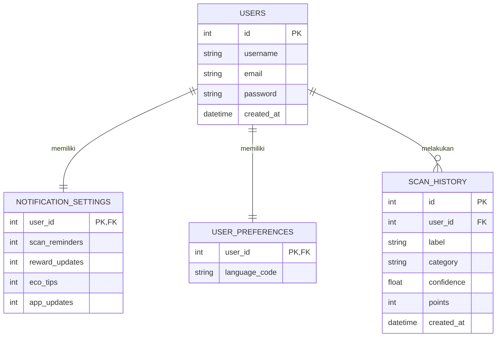

# Software Requirements Specification (SRS)
## EcoClassify (CyberWasteApp)

---

### **Daftar Dokumen Informasi**
*   **Nama Produk:** EcoClassify (CyberWasteApp)
*   **Versi Dokumen:** v1.0.0
*   **Tanggal:** 17 Juni 2026
*   **Status:** Selesai (Final)
*   **Target Pengguna:** Masyarakat umum, akademisi, aktivis lingkungan, pengelola bank sampah.
*   **Instansi/Konteks:** Tugas Mata Kuliah Aplikasi Pemrograman Terintegrasi (APL) / Kompetisi Aplikasi Lingkungan Hidup.

---

## 1. PENDAHULUAN (INTRODUCTION)

### 1.1 Tujuan Dokumen (Purpose)
Dokumen *Software Requirements Specification* (SRS) ini dibuat untuk mendokumentasikan spesifikasi kebutuhan perangkat lunak bagi aplikasi **EcoClassify (CyberWasteApp)**. Dokumen ini bertujuan untuk memberikan panduan teknis yang jelas dan komprehensif bagi pengembang frontend, pengembang backend, serta analis sistem dalam memahami seluruh kebutuhan fungsional dan non-fungsional dari sistem ini.

### 1.2 Ruang Lingkup Produk (Product Scope)
EcoClassify adalah sebuah platform berbasis mobile (React Native/Expo) yang diintegrasikan dengan backend API (Node.js Express) dan sistem deteksi citra berbasis kecerdasan buatan (*Deep Learning* Convolutional Neural Network - CNN menggunakan Python TensorFlow). 
Sistem ini dirancang untuk memfasilitasi:
1.  **Klasifikasi Sampah Cerdas:** Memindai sampah melalui kamera ponsel secara *real-time* untuk mendeteksi kategori Organik, Anorganik, dan B3 (ke depan).
2.  **Sistem Gamifikasi & Eco Poin:** Memberikan poin insentif bagi pengguna setelah memilah sampah secara tepat.
3.  **Kalkulator CO2:** Mengonversi jumlah sampah daur ulang menjadi estimasi metrik emisi gas rumah kaca (CO2) yang dikurangi.
4.  **Katalog Penukaran Hadiah:** Memberikan fasilitas penukaran Eco Poin dengan hadiah berupa *voucher* belanja, pulsa, bibit pohon, dll.
5.  **Papan Peringkat Global (Leaderboard):** Mendorong kompetisi positif antar-pengguna dalam melestarikan lingkungan.

### 1.3 Definisi, Akronim, dan Singkatan
*   **SRS:** *Software Requirements Specification* (Spesifikasi Kebutuhan Perangkat Lunak).
*   **PRD:** *Product Requirement Document* (Dokumen Kebutuhan Produk).
*   **CNN:** *Convolutional Neural Network* (Algoritma Deep Learning untuk citra).
*   **JWT:** *JSON Web Token* (Metode autentikasi berbasis token).
*   **API:** *Application Programming Interface*.
*   **B3:** Bahan Berbahaya dan Beracun.
*   **SQLite3:** Sistem Manajemen Database Relasional ringan berbasis berkas lokal.
*   **Expo:** Framework wrapper untuk pengembangan lintas-platform React Native.

### 1.4 Referensi
1.  IEEE Std 830-1998, *IEEE Recommended Practice for Software Requirements Specifications*.
2.  *Product Requirement Document* (PRD) - EcoClassify v1.0.0.
3.  Dokumentasi Resmi Expo SDK v55.0.0 (https://docs.expo.dev/versions/v55.0.0/).
4.  Dokumentasi TensorFlow & Keras (https://keras.io).

### 1.5 Deskripsi Umum Dokumen
Dokumen ini terbagi menjadi empat bab utama:
*   **Bab 1: Pendahuluan** menerangkan informasi umum dokumen, ruang lingkup, dan referensi.
*   **Bab 2: Deskripsi Umum Sistem** menjelaskan arsitektur sistem, perspektif produk, fungsi-fungsi utama, karakteristik pengguna, dan batasan sistem.
*   **Bab 3: Kebutuhan Spesifik** memuat detail kebutuhan fungsional (analisis input-proses-output), kebutuhan antarmuka eksternal, kebutuhan non-fungsional, spesifikasi API, serta skema database relasional.
*   **Bab 4: Lampiran** memuat catatan penutup dan diagram alur pendukung.

---

## 2. DESKRIPSI UMUM SISTEM (OVERALL DESCRIPTION)

### 2.1 Perspektif Produk (Product Perspective)
EcoClassify dirancang dengan menggunakan arsitektur tiga lapis (*Three-Tier Architecture*) yang terdiri dari:
1.  **Presentation Layer (Frontend):** Aplikasi mobile berbasis React Native/Expo untuk iOS dan Android.
2.  **Application Layer (Backend Server):** RESTful API berbasis Node.js Express yang menangani logika bisnis, autentikasi, log riwayat, dan koordinasi file.
3.  **Machine Learning Service (AI Engine):** Subsistem Python TensorFlow yang dijalankan sebagai *child process* oleh backend untuk melakukan inferensi model CNN pada berkas gambar sampah yang dikirimkan.
4.  **Database Layer (Data Store):** SQLite3 sebagai tempat penyimpanan persisten berbasis berkas lokal (`database.sqlite`).

#### **Diagram Arsitektur Sistem**
```mermaid
graph TD
    subgraph Frontend Mobile (React Native + Expo)
        UI[Antarmuka Pengguna]
        Cam[Expo Camera App]
        Redux[Redux Store & Navigation]
    end

    subgraph Backend Server (Node.js Express)
        API[Express Router & Middleware]
        Auth[JWT & bcrypt Hashing]
        Proc[Child Process Spawner]
        Multer[Multer File Uploader]
    end

    subgraph AI Engine (Python TensorFlow)
        Py[predict_image.py]
        Model[best_model.keras]
        Labels[labels.json]
    end

    subgraph Database Layer
        DB[(database.sqlite)]
    end

    UI <-->|HTTP API / JSON| API
    Cam -->|Upload Multipart Form| Multer
    API <--> DB
    API -->|execFile python.exe| Py
    Py -->|Load Model & Labels| Model & Labels
    Py -->|Stdout JSON| API
```

### 2.2 Antarmuka Sistem (Interfaces)

#### 2.2.1 Antarmuka Pengguna (User Interface)
Aplikasi mobile menggunakan antarmuka modern dengan dukungan tema yang konsisten, animasi mikro, dan transisi antar-layar yang mulus. Layar utama mencakup:
*   **Layar Autentikasi:** Form registrasi, login, dan validasi *password* dengan batas karakter.
*   **Dashboard:** Menampilkan status konektivitas model AI ("Model siap!"), ringkasan kategori sampah yang didukung, dan navigasi cepat menuju Scanner.
*   **Layar Scanner:** Tampilan kamera dinamis (`expo-camera`) dilengkapi dengan indikator *capture* dan modal hasil klasifikasi yang menyajikan label sampah, kategori, tingkat akurasi (%), dan perolehan Eco Poin.
*   **Layar Riwayat Scan:** Daftar kronologis pemindaian dalam bentuk *scrollable list* dengan visualisasi kartu (*Card*) terperinci.
*   **Layar Eco Poin & Hadiah:** Ringkasan level pengguna (`Bronze`, `Silver`, `Gold`, `Platinum`), indikator kemajuan poin menuju level berikutnya, kalkulator dampak pengurangan emisi CO2, serta daftar penukaran hadiah.
*   **Layar Papan Peringkat:** Visualisasi 10 pengguna teratas berdasarkan total Eco Poin yang dikumpulkan, lengkap dengan posisi peringkat pengguna saat ini.
*   **Layar Profil & Pengaturan:** Menu ubah data dasar profil, verifikasi penggantian kata sandi lama, pemilihan bahasa terjemahan (ID, EN, JV, SU), serta *toggle button* untuk konfigurasi preferensi notifikasi secara *real-time*.

#### 2.2.2 Antarmuka Perangkat Keras (Hardware Interface)
Aplikasi seluler memerlukan hak akses perangkat keras berikut:
*   **Kamera:** Diperlukan untuk mengambil gambar sampah secara langsung melalaui *scanner*.
*   **Penyimpanan Lokal (Storage):** Diperlukan untuk penyimpanan data sementara/cache aplikasi seluler dan penyimpanan sesi token JWT (`SecureStore` atau `AsyncStorage`).

#### 2.2.3 Antarmuka Perangkat Lunak (Software Interface)
*   **Sistem Operasi Ponsel:** Android OS 9.0 (API Level 28) ke atas, atau iOS 13 ke atas.
*   **Runtime Backend:** Node.js v18.x ke atas.
*   **Interpreter Python:** Python 3.10.x atau 3.11.x dengan TensorFlow 2.10+.
*   **Mesin Database:** SQLite3 Library.

#### 2.2.4 Antarmuka Komunikasi (Communication Interface)
*   **Protokol REST API:** Komunikasi data menggunakan HTTP/HTTPS standar.
*   **Format Pertukaran Data:** JSON (*JavaScript Object Notation*) untuk semua request dan response API.
*   **Metode Autentikasi:** Header Authorization berbasis `Bearer Token` dengan skema enkripsi JWT.
*   **Pengunggahan Berkas:** Protokol `multipart/form-data` untuk transmisi data gambar dari aplikasi mobile ke backend.

### 2.3 Fungsi Produk (Product Functions)
1.  **F-01 (Autentikasi & Otorisasi):** Mengelola pendaftaran akun baru, login pengguna, validasi kecocokan kredensial, dan manajemen masa aktif token (7 hari).
2.  **F-02 (Dashboard & Status):** Menyediakan portal pusat informasi bagi pengguna terkait kapasitas model deteksi, pintasan cepat, dan kategori sampah yang valid.
3.  **F-03 (Klasifikasi Sampah berbasis AI):** Memproses unggahan foto sampah, menjalankan skrip inferensi Python TensorFlow, dan menghasilkan prediksi kategori sampah.
4.  **F-04 (Sistem Poin & Gamifikasi):** Menghitung pertambahan poin pengguna berdasarkan klasifikasi sampah (Organik: 5, Anorganik: 10, B3: 25) serta memperbarui level peringkat pengguna (`Bronze`, `Silver`, `Gold`, `Platinum`).
5.  **F-05 (Kalkulator CO2):** Menampilkan estimasi kontribusi pengguna terhadap pelestarian bumi yang dihitung dari total pemindaian (`jumlah pemindaian * 0.68 kg CO2`).
6.  **F-06 (Katalog Penukaran Hadiah):** Mengelola transaksi virtual penukaran poin dengan daftar hadiah yang tersedia di katalog.
7.  **F-07 (Leaderboard Poin):** Menampilkan peringkat 10 besar pengguna global berdasarkan perolehan poin terbanyak serta posisi user saat ini.
8.  **F-08 (Riwayat Deteksi):** Menampilkan rekam jejak historis aktivitas daur ulang pengguna secara kronologis.
9.  **F-09 (Pengaturan Bahasa & Preferensi):** Menyimpan preferensi konfigurasi notifikasi pengguna dan kode bahasa yang diinginkan.

### 2.4 Karakteristik Pengguna (User Characteristics)
Pengguna sistem ini dibagi menjadi kategori umum:
*   **Pengguna Umum (Masyarakat):** Pengguna yang memiliki tingkat keahlian teknologi dasar hingga menengah, memerlukan navigasi yang intuitif, ramah pengguna (user-friendly), dan menginginkan proses pemindaian yang instan serta menarik secara visual.

### 2.5 Batasan-batasan (Constraints)
*   **Konektivitas Jaringan:** Selama model TensorFlow dijalankan di backend, aplikasi memerlukan koneksi internet aktif untuk mengirimkan gambar dan menerima respons.
*   **Efisiensi Penyimpanan Server:** Untuk menghindari penumpukan file sampah digital, berkas gambar yang diunggah ke backend melalui Multer harus segera dihapus secara asinkron setelah proses prediksi AI selesai dijalankan.
*   **Keterbatasan Perangkat Keras Model AI:** Model CNN memerlukan memori RAM yang cukup pada server backend untuk memuat model Keras (`best_model.keras`) saat proses pemanggilan skrip inferensi Python.

### 2.6 Asumsi dan Ketergantungan (Assumptions and Dependencies)
*   **Asumsi:** Pengguna memiliki ponsel pintar dengan kamera yang berfungsi baik dan pencahayaan yang cukup saat memotret objek sampah.
*   **Ketergantungan:**
    *   File model `best_model.keras` dan metadata pendukung `labels.json` harus selalu tersedia pada folder `ml/artifacts/` di server backend.
    *   Environment Python di server backend harus memiliki library `tensorflow` dan `numpy` yang terpasang secara kompatibel.

---

## 3. KEBUTUHAN SPESIFIK (SPECIFIC REQUIREMENTS)

### 3.1 Kebutuhan Fungsional (Functional Requirements)

#### **RF-01: Autentikasi Pengguna**
*   **Deskripsi:** Sistem harus memungkinkan pengguna mendaftarkan akun baru dan masuk ke dalam sistem menggunakan token JWT.
*   **Masukan (Input):**
    *   Registrasi: `username` (unik), `email` (unik), `password` (minimal 6 karakter).
    *   Login: `emailOrUsername`, `password`.
*   **Proses:**
    *   Melakukan validasi format input dan panjang password.
    *   Memeriksa duplikasi data username atau email pada database SQLite.
    *   Melakukan hashing password menggunakan `bcryptjs` (salt rounds: 10).
    *   Menerbitkan token JWT dengan masa kedaluwarsa 7 hari jika kredensial login sesuai.
*   **Keluaran (Output):**
    *   Registrasi: Pesan sukses/gagal registrasi.
    *   Login: Token JWT dan data informasi profil dasar pengguna (`id`, `username`, `email`, `created_at`).

#### **RF-02: Dashboard & Pemantauan Model AI**
*   **Deskripsi:** Menyediakan tampilan utama yang menginformasikan status operasional sistem AI dan ringkasan sampah yang dapat dipindai.
*   **Masukan (Input):** Permintaan HTTP GET ke server backend.
*   **Proses:** Memeriksa keberadaan file `best_model.keras` dan `labels.json`. Jika ada, server akan mengirimkan respons status aktif.
*   **Keluaran (Output):** Indikator visual status keaktifan model AI dan daftar panduan jenis sampah Organik dan Anorganik yang didukung.

#### **RF-03: Pemindaian & Klasifikasi Sampah (AI Waste Scan)**
*   **Deskripsi:** Memproses foto sampah dari kamera ponsel untuk dideteksi oleh kecerdasan buatan.
*   **Masukan (Input):** Berkas gambar (*Multipart Form Data*) dan Token JWT pada header Authorization.
*   **Proses:**
    *   Memvalidasi validitas sesi token JWT pengguna.
    *   Menyimpan file gambar ke direktori `backend/uploads/` menggunakan Multer.
    *   Mengeksekusi skrip Python `ml/predict_image.py` menggunakan `execFile` dengan parameter `--image <path_foto>` dan berkas model AI.
    *   Skrip Python mengubah ukuran gambar ke dimensi input model (default: 224x224), mengonversinya menjadi larik NumPy, menjalankan prediksi forward-pass pada model TensorFlow, mengidentifikasi indeks probabilitas tertinggi, memetakan ke kategori Organik/Anorganik/B3, dan mencetak hasil ke `stdout` dalam format JSON.
    *   Backend Express menangkap output JSON, mengonversinya menjadi objek, menyimpannya ke tabel `scan_history` dalam database, dan memicu penghapusan gambar dari folder lokal secara asinkron.
*   **Keluaran (Output):** Objek prediksi sampah (`label`, `category`, `confidence`, `points`) yang dikirim ke aplikasi mobile.

#### **RF-04: Penghitungan Dampak Lingkungan & Gamifikasi**
*   **Deskripsi:** Menghitung perolehan Eco Poin, kemajuan Level, dan estimasi reduksi CO2.
*   **Masukan (Input):** Data riwayat pemindaian pengguna pada tabel `scan_history`.
*   **Proses:**
    *   Eco Poin diakumulasikan berdasarkan kategori sampah: Organik = 5 poin, Anorganik = 10 poin, B3 = 25 poin.
    *   Level dihitung dengan batas:
        *   `Bronze`: 0 - 99 Poin.
        *   `Silver`: 100 - 299 Poin.
        *   `Gold`: 300 - 699 Poin.
        *   `Platinum`: >= 700 Poin.
    *   Metrik reduksi emisi CO2 dihitung dengan formula: `jumlah item yang dipindai (daur ulang) * 0.68 kg CO2`.
*   **Keluaran (Output):** Ringkasan gamifikasi pengguna yang mencakup `totalPoints`, `level`, `nextLevelPoints`, `nextLevelName`, `co2Saved`, dan `itemsRecycled`.

#### **RF-05: Papan Peringkat Global (Leaderboard)**
*   **Deskripsi:** Menyajikan 10 peringkat teratas pengguna secara global berdasarkan Eco Poin terbanyak.
*   **Masukan (Input):** Permintaan data peringkat pengguna dari aplikasi seluler dengan token JWT.
*   **Proses:**
    *   Melakukan query agregasi `SUM(points)` dari tabel `users` yang berelasi dengan `scan_history` di database.
    *   Mengurutkan secara *descending* berdasarkan total poin.
    *   Menghitung peringkat (*rank*) berbasis indeks hasil query.
    *   Mencari peringkat user aktif dalam daftar global.
*   **Keluaran (Output):** Daftar top 10 pengguna beserta poin mereka, dan detail objek peringkat pengguna saat ini.

#### **RF-06: Penukaran Hadiah (Rewards)**
*   **Deskripsi:** Mengurangi poin pengguna untuk ditukarkan dengan voucer belanja atau barang fisik ramah lingkungan.
*   **Masukan (Input):** ID Hadiah yang dipilih dan token JWT pengguna.
*   **Proses:**
    *   Memeriksa ketersediaan hadiah berdasarkan properti `available` di katalog.
    *   Mengambil total poin yang dikumpulkan dari riwayat scan pengguna.
    *   Memastikan poin pengguna mencukupi kebutuhan poin hadiah.
    *   Mengurangi akumulasi poin pengguna (dalam prototipe ini dihitung secara dinamis dari agregasi transaksi poin di riwayat scan, penukaran akan mencatat transaksi negatif di database/histori di pengembangan lebih lanjut).
*   **Keluaran (Output):** Pesan keberhasilan penukaran dan pengurangan sisa Eco Poin.

#### **RF-07: Riwayat Pemindaian (Scan History)**
*   **Deskripsi:** Menyajikan seluruh rekam jejak deteksi sampah yang pernah dilakukan oleh pengguna.
*   **Masukan (Input):** Token JWT pengguna.
*   **Proses:** Melakukan query database pada tabel `scan_history` yang difilter berdasarkan `user_id` pengguna bersangkutan dan diurutkan dari yang terbaru (`DESC`).
*   **Keluaran (Output):** Larik (*array*) riwayat scan berisi atribut `id`, `wasteType`, `category`, `confidence`, `points`, dan `date`.

#### **RF-08: Pengaturan Lanjutan (Profil, Notifikasi & Bahasa)**
*   **Deskripsi:** Menyediakan kontrol atas konfigurasi akun, preferensi notifikasi, dan bahasa antarmuka aplikasi.
*   **Masukan (Input):**
    *   Ubah Profil: `username`, `email`.
    *   Ubah Password: `currentPassword`, `newPassword`.
    *   Notifikasi: `scanReminders` (boolean), `rewardUpdates` (boolean), `ecoTips` (boolean), `appUpdates` (boolean).
    *   Bahasa: `languageCode` (pilihan: `id`, `en`, `jv`, `su`).
*   **Proses:**
    *   Melakukan update tabel `users` untuk perubahan nama pengguna/email dengan verifikasi keunikan data.
    *   Memverifikasi kata sandi lama sebelum mengenkripsi kata sandi baru.
    *   Menyimpan konfigurasi notifikasi ke tabel `notification_settings` menggunakan query `ON CONFLICT DO UPDATE`.
    *   Menyimpan preferensi bahasa ke tabel `user_preferences`.
*   **Keluaran (Output):** Data profil baru atau status keberhasilan penyimpanan preferensi.

---

### 3.2 Kebutuhan Non-Fungsional (Non-Functional Requirements)

| Kode KNF | Parameter Kebutuhan | Deskripsi Detail Batasan |
| :--- | :--- | :--- |
| **RN-01** | **Keamanan (Security)** | 1. Kata sandi pengguna harus di-hash menggunakan algoritma Bcrypt sebelum masuk ke database.<br>2. Endpoint privat dilindungi oleh otorisasi berbasis JSON Web Token (JWT) pada header request.<br>3. Seluruh query SQL ke database SQLite harus menggunakan parameter binding guna mencegah kerentanan SQL Injection. |
| **RN-02** | **Kinerja (Performance)** | 1. Waktu eksekusi inferensi AI (mulai dari pemanggilan python child process hingga keluaran hasil prediksi) tidak boleh melebihi 5 detik.<br>2. Berkas gambar yang diunggah ke server backend harus dihapus menggunakan `fs.unlink` dalam kurun waktu kurang dari 1 detik setelah klasifikasi selesai untuk menjaga ruang penyimpanan disk server. |
| **RN-03** | **Kompatibilitas (Compatibility)** | 1. Aplikasi frontend harus kompatibel dengan perangkat Android 9+ dan iOS 13+ melalui bundle Expo.<br>2. Kode backend harus berjalan dengan baik pada runtime Node.js v18 (LTS) ke atas di lingkungan Windows/Linux. |
| **RN-04** | **Atribut Kualitas (Usability)** | 1. Antarmuka aplikasi harus mendukung lokalisasi bahasa (Indonesian, English, Javanese, Sundanese).<br>2. Aplikasi harus menampilkan visual status keaktifan model AI secara dinamis di halaman depan. |

---

### 3.3 Skema Database & Relasi (Database Schema)

Database relasional disimpan dalam file tunggal `backend/database.sqlite`. Struktur skema tabel yang digunakan didefinisikan sebagai berikut:

#### 1. Tabel `users`
Tabel utama untuk mencatat akun pengguna terdaftar.
```sql
CREATE TABLE IF NOT EXISTS users (
  id INTEGER PRIMARY KEY AUTOINCREMENT,
  username TEXT NOT NULL UNIQUE,
  email TEXT NOT NULL UNIQUE,
  password TEXT NOT NULL,
  created_at DATETIME DEFAULT CURRENT_TIMESTAMP
);
```

#### 2. Tabel `notification_settings`
Menyimpan konfigurasi preferensi notifikasi individual pengguna.
```sql
CREATE TABLE IF NOT EXISTS notification_settings (
  user_id INTEGER PRIMARY KEY,
  scan_reminders INTEGER DEFAULT 1,
  reward_updates INTEGER DEFAULT 1,
  eco_tips INTEGER DEFAULT 1,
  app_updates INTEGER DEFAULT 1,
  FOREIGN KEY (user_id) REFERENCES users(id)
);
```

#### 3. Tabel `user_preferences`
Menyimpan konfigurasi bahasa aplikasi seluler pilihan pengguna.
```sql
CREATE TABLE IF NOT EXISTS user_preferences (
  user_id INTEGER PRIMARY KEY,
  language_code TEXT DEFAULT 'id',
  FOREIGN KEY (user_id) REFERENCES users(id)
);
```

#### 4. Tabel `scan_history`
Menyimpan seluruh riwayat log aktivitas pemindaian sampah pengguna dan perolehan Eco Poin.
```sql
CREATE TABLE IF NOT EXISTS scan_history (
  id INTEGER PRIMARY KEY AUTOINCREMENT,
  user_id INTEGER NOT NULL,
  label TEXT NOT NULL,
  category TEXT NOT NULL,
  confidence REAL NOT NULL,
  points INTEGER NOT NULL,
  created_at DATETIME DEFAULT CURRENT_TIMESTAMP,
  FOREIGN KEY (user_id) REFERENCES users(id)
);
```

#### **Diagram Relasi Entitas (Entity-Relationship Diagram)**


---

### 3.4 Spesifikasi REST API (API Endpoint Specifications)

#### **1. Autentikasi & Akun**
*   **Registrasi Akun**
    *   **Endpoint:** `POST /api/auth/register`
    *   **Request Body:**
        ```json
        {
          "username": "budi123",
          "email": "budi@mail.com",
          "password": "passwordrahasia"
        }
        ```
    *   **Response (201 Created):**
        ```json
        {
          "success": true,
          "message": "Registrasi berhasil!"
        }
        ```

*   **Masuk Sistem (Login)**
    *   **Endpoint:** `POST /api/auth/login`
    *   **Request Body:**
        ```json
        {
          "emailOrUsername": "budi@mail.com",
          "password": "passwordrahasia"
        }
        ```
    *   **Response (200 OK):**
        ```json
        {
          "success": true,
          "message": "Login berhasil!",
          "token": "eyJhbGciOiJIUzI1NiIsInR5cCI6IkpXVCJ9...",
          "user": {
            "id": 1,
            "username": "budi123",
            "email": "budi@mail.com",
            "created_at": "2026-06-17 10:00:00"
          }
        }
        ```

*   **Informasi Profil Pengguna**
    *   **Endpoint:** `GET /api/auth/me`
    *   **Headers:** `Authorization: Bearer <token>`
    *   **Response (200 OK):**
        ```json
        {
          "success": true,
          "user": {
            "id": 1,
            "username": "budi123",
            "email": "budi@mail.com",
            "created_at": "2026-06-17 10:00:00"
          }
        }
        ```

*   **Pembaruan Profil**
    *   **Endpoint:** `PUT /api/profile`
    *   **Headers:** `Authorization: Bearer <token>`
    *   **Request Body:**
        ```json
        {
          "username": "budi_baru",
          "email": "budi_baru@mail.com"
        }
        ```
    *   **Response (200 OK):**
        ```json
        {
          "success": true,
          "user": {
            "id": 1,
            "username": "budi_baru",
            "email": "budi_baru@mail.com",
            "created_at": "2026-06-17 10:00:00"
          }
        }
        ```

*   **Ubah Kata Sandi**
    *   **Endpoint:** `PUT /api/auth/change-password`
    *   **Headers:** `Authorization: Bearer <token>`
    *   **Request Body:**
        ```json
        {
          "currentPassword": "passwordrahasia",
          "newPassword": "passwordbarusecret"
        }
        ```
    *   **Response (200 OK):**
        ```json
        {
          "success": true,
          "message": "Password berhasil diperbarui"
        }
        ```

#### **2. Pengaturan Preferensi**
*   **Mendapatkan Pengaturan Notifikasi**
    *   **Endpoint:** `GET /api/notification-settings`
    *   **Headers:** `Authorization: Bearer <token>`
    *   **Response (200 OK):**
        ```json
        {
          "success": true,
          "settings": {
            "scanReminders": true,
            "rewardUpdates": true,
            "ecoTips": true,
            "appUpdates": true
          }
        }
        ```

*   **Memperbarui Pengaturan Notifikasi**
    *   **Endpoint:** `PUT /api/notification-settings`
    *   **Headers:** `Authorization: Bearer <token>`
    *   **Request Body:**
        ```json
        {
          "scanReminders": true,
          "rewardUpdates": false,
          "ecoTips": true,
          "appUpdates": true
        }
        ```
    *   **Response (200 OK):**
        ```json
        {
          "success": true,
          "message": "Pengaturan notifikasi tersimpan"
        }
        ```

*   **Mendapatkan Preferensi Bahasa**
    *   **Endpoint:** `GET /api/languages`
    *   **Headers:** `Authorization: Bearer <token>`
    *   **Response (200 OK):**
        ```json
        {
          "success": true,
          "languages": [
            { "code": "id", "name": "Indonesia", "nativeName": "Bahasa Indonesia" },
            { "code": "en", "name": "English", "nativeName": "English" },
            { "code": "jv", "name": "Javanese", "nativeName": "Basa Jawa" },
            { "code": "su", "name": "Sundanese", "nativeName": "Basa Sunda" }
          ],
          "selectedLanguage": "id"
        }
        ```

*   **Mengubah Preferensi Bahasa**
    *   **Endpoint:** `PUT /api/languages`
    *   **Headers:** `Authorization: Bearer <token>`
    *   **Request Body:**
        ```json
        {
          "languageCode": "en"
        }
        ```
    *   **Response (200 OK):**
        ```json
        {
          "success": true,
          "selectedLanguage": "en"
        }
        ```

#### **3. Riwayat, Eco Poin & AI Klasifikasi**
*   **Pemindaian Sampah Cerdas (AI Scan Waste)**
    *   **Endpoint:** `POST /api/predict-waste`
    *   **Headers:** `Authorization: Bearer <token>`, `Content-Type: multipart/form-data`
    *   **Request Body:** `image` (Berkas Gambar/Foto)
    *   **Response (200 OK):**
        ```json
        {
          "success": true,
          "prediction": {
            "label": "plastic",
            "category": "Anorganik",
            "confidence": 0.9854,
            "points": 10
          }
        }
        ```

*   **Mendapatkan Riwayat Scan**
    *   **Endpoint:** `GET /api/scan-history`
    *   **Headers:** `Authorization: Bearer <token>`
    *   **Response (200 OK):**
        ```json
        {
          "success": true,
          "history": [
            {
              "id": "12",
              "wasteType": "plastic",
              "category": "Anorganik",
              "confidence": 0.9854,
              "points": 10,
              "date": "2026-06-17 11:24:10"
            }
          ],
          "summary": {
            "totalPoints": 10,
            "totalScan": 1
          }
        }
        ```

*   **Mendapatkan Statistik Eco Poin & Level**
    *   **Endpoint:** `GET /api/eco-points`
    *   **Headers:** `Authorization: Bearer <token>`
    *   **Response (200 OK):**
        ```json
        {
          "success": true,
          "userPoints": {
            "totalPoints": 125,
            "level": "Silver",
            "nextLevelPoints": 300,
            "nextLevelName": "Gold",
            "co2Saved": 8.5,
            "itemsRecycled": 12
          },
          "rewards": [
            {
              "id": 1,
              "name": "Voucher Belanja",
              "description": "Voucher Rp10.000",
              "points": 50,
              "icon": "cart-outline",
              "available": true
            },
            {
              "id": 2,
              "name": "Pulsa Listrik",
              "description": "Pulsa Rp20.000",
              "points": 100,
              "icon": "flash-outline",
              "available": true
            }
          ]
        }
        ```

*   **Mendapatkan Papan Peringkat Global (Leaderboard)**
    *   **Endpoint:** `GET /api/leaderboard`
    *   **Headers:** `Authorization: Bearer <token>`
    *   **Response (200 OK):**
        ```json
        {
          "success": true,
          "leaderboard": [
            {
              "rank": 1,
              "userId": 4,
              "username": "lestari_bumi",
              "totalPoints": 1250,
              "scanCount": 120
            },
            {
              "rank": 2,
              "userId": 1,
              "username": "budi123",
              "totalPoints": 125,
              "scanCount": 12
            }
          ],
          "currentUserRank": {
            "rank": 2,
            "userId": 1,
            "username": "budi123",
            "totalPoints": 125,
            "scanCount": 12
          }
        }
        ```

---

## 4. LAMPIRAN (APPENDICES)

### 4.1 Hubungan Poin & Dampak Lingkungan
Penetapan skor Eco Poin dan reduksi karbon dirumuskan sebagai langkah gamifikasi dengan rincian berikut:
*   **Sampah Organik (5 Poin):** Proses pembusukan organik berkontribusi pada gas metana jika tidak diolah, pemilahan dinilai penting dengan bobot 5.
*   **Sampah Anorganik (10 Poin):** Sampah yang sulit terurai secara alami dan membutuhkan daur ulang industri (plastik, kaca, logam, kardus) memiliki poin lebih tinggi guna menarik minat daur ulang.
*   **Sampah B3 (25 Poin):** Sampah beracun (limbah elektronik, baterai) memiliki dampak polusi yang sangat tinggi dan tingkat penanganan yang rumit, diberi reward maksimal untuk pencegahan pembuangan sembarangan.
*   **Metrik Emisi Karbon (0.68 kg CO2):** Diadopsi dari estimasi rata-rata konversi energi daur ulang limbah padat perkotaan per kilogram bahan yang berhasil diselamatkan dari TPA (Tempat Pembuangan Akhir).
